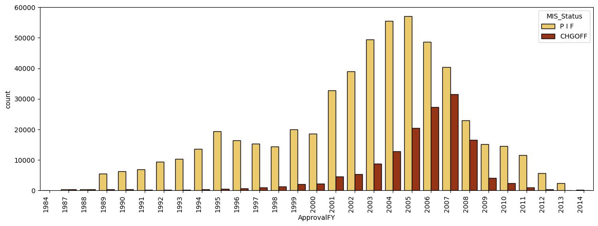
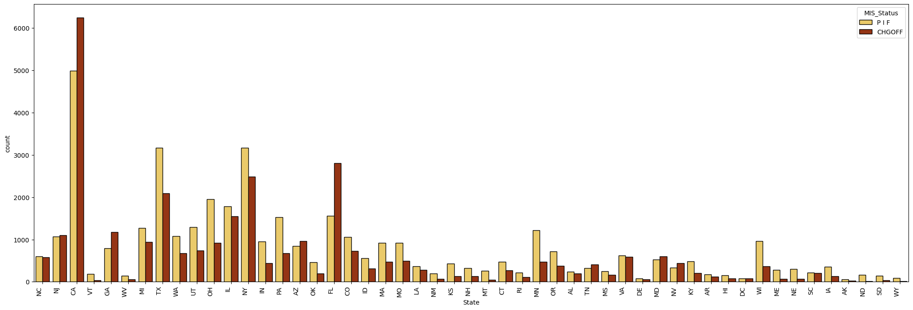
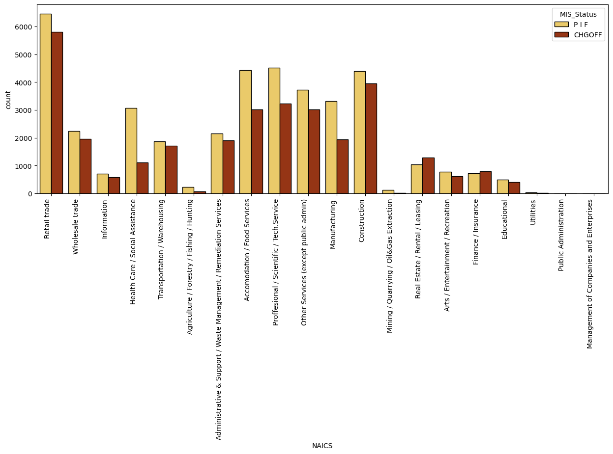
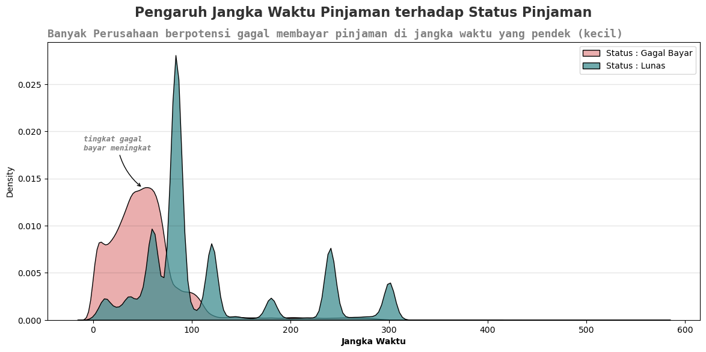
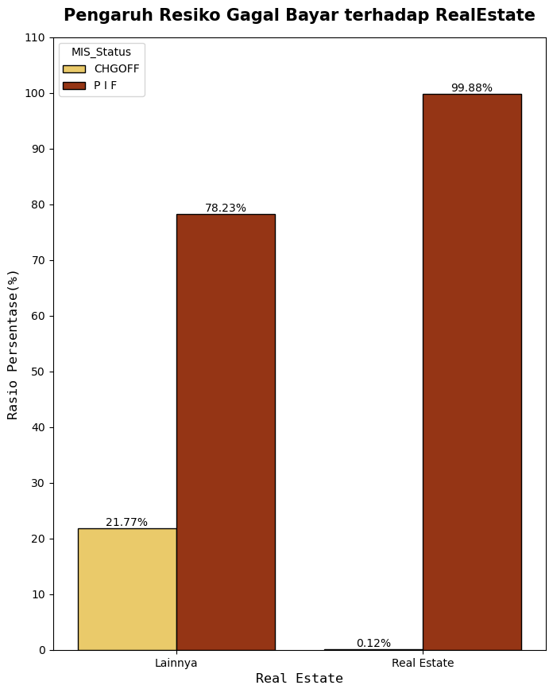
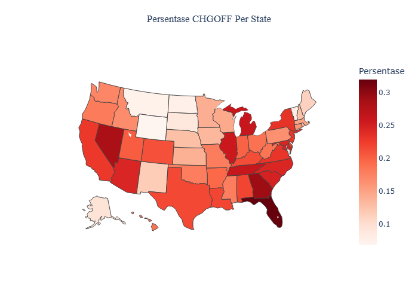

# 4. Business Insight

Pada Business Insight ini kami membuat beberapa variabel dummy dan sedikit merubah bentuk data yang seharusnya terjadi pada stage preprocessing.

## 4.1. Pengaruh "MIS_Status" (Status Pinjaman) terhadap "ApprovalFY" (Tahun diterimanya Pinjaman)

```python
plt.figure(figsize=(15,5))
sns.countplot(data=df,x='ApprovalFY',hue='MIS_Status',   palette = 'afmhot_r',
            lw = 1, ec = 'k')
plt.xticks(rotation=90, ha='right')
plt.show()
```



**Keterangan :**<br>
Dari Informasi diatas dapat dilihat bahawa tingkat gagal bayar (CHGOFF) paling banyak terletak pada tahun "2007" dan hal ini terjadi pada saat dimulainya "great recession 2007 -2009". jadi masuk akal jika tingkat gagal bayar (CHGOFF) tinggi.

- Sumber : https://www.bls.gov/spotlight/2012/recession/

#### Mari kita lihat tingkat gagal bayar berdasarkan State(Negara Bagian) selama tahun "2007"

```python
plt.figure(figsize=(25,8))
sns.countplot(data=df[df['ApprovalFY'] == 2007],x='State',hue='MIS_Status',  palette = 'afmhot_r',
            lw = 1, ec = 'k')
plt.xticks(rotation=90, ha='right')
plt.show()
```



**Keterangan :**<br>
Ternyata terdapat **"State"** (Negara Bagian) yang tingkat gagal bayarnya **(CHGOFF)** cukup signifikan melebihi tingkat berhasil bayar **(P I F)**, terlihat dari plot diatas yaitu state **"CA", "FL", "GA" & "MD"**

#### Mari kita lihat tingkat gagal bayar dari sektor industri selama tahun "2007"

```python
plt.figure(figsize=(15,5))
sns.countplot(data=df[df['ApprovalFY'] == 2007],x='NAICS',hue='MIS_Status',  palette = 'afmhot_r',
            lw = 1, ec = 'k')
plt.xticks(rotation=90, ha='right')
plt.show()
```



Ada hal yang menarik disini, terlihat bahwa sector industri **"Healt Care/Social Assistance"** memiliki tingkat gagal bayar yang kecil, yang berarti dari **"sektor industri"** tersebut tidak terlalu banyak mempengaruhi resiko gagal bayar selama resesi ekonomi.

#### Dari penjelasan diatas kita dapat memberikan rekomendasi business jika terjadi resesi: <br>

- SBA perlu menambahkan persyaratan kredit yang lebih ketat, SBA dapat menetapkan standar kredit yang lebih ketat untuk meminimalkan risiko gagal bayar. Persyaratan kredit yang ketat dapat memastikan bahwa hanya bisnis terbaik dari **"State" & "Sektor Industri"** terbaiklah yang memenuhi syarat untuk mendapatkan pinjaman dan lebih mampu membayar kembali pinjaman selama masa resesi ekonomi.
- Sebagai lembaga pemerintah SBA juga berperan untuk membantu memulihkan ekonomi selama resesi yaitu dengan meningkatkan edukasi keuangan melalui program konseling SBA, seingga dapat meningkatkan edukasi keuangan bagi bisnis kecil untuk membantu mereka memahami risiko dan cara mengelola keuangan mereka selama masa resesi ekonomi. Edukasi keuangan dapat membantu bisnis kecil mengambil keputusan yang lebih baik dalam pengelolaan keuangan mereka dan meminimalkan risiko gagal bayar.

## 4.2. Pengaruh "MIS_Status" (Status Pinjaman) terhadap "Term" (Jangka Waktu Pinjaman)

```python
#create column
CHGOFF = df[df['MIS_Status'] == 'CHGOFF']
PIF = df[df['MIS_Status'] == 'P I F']

fig, ax = plt.subplots(1, 1, figsize = (14, 6))

sns.kdeplot(x = 'Term', data = CHGOFF, label = 'Status : Gagal Bayar',
            color = '#E49393', fill = True, multiple = 'stack', ax = ax)

sns.kdeplot(x = 'Term', data = PIF, label = 'Status : Lunas',
            color = '#408E91', fill = True, multiple = 'stack', ax = ax)

fig.suptitle("Pengaruh Jangka Waktu Pinjaman terhadap Status Pinjaman", fontsize=16, fontweight='bold', family='sansserif', color='#323232')
plt.title('Banyak Perusahaan berpotensi gagal membayar pinjaman di jangka waktu yang pendek (kecil)', fontsize=13, fontweight='bold', family='monospace', color='grey', loc ='left')
plt.annotate('tingkat gagal\nbayar meningkat', fontstyle='italic',  fontname='monospace', color ='grey',fontweight='bold', fontsize=9,xy=(50,0.014),arrowprops=dict(arrowstyle='->',connectionstyle='arc3,rad=.2'),xytext=(-10,0.018))
ax.grid(c = 'black', lw = 1, axis = 'y', alpha = 0.1)
ax.set_xlabel('Jangka Waktu',  weight = 'bold')
ax.legend()

plt.show()
```



**Keterangan :**<br>
dari plot diatas terlihat bahwa tingkat resiko gagal bayar banyak terjadi dijangka waktu **(Term)** yang pendek < 100. hal ini juga menyatakan bahwa semakin lama jangka waktu yang diberikan, semakin besar juga kemungkinan bisnis dapat berkembang dan hal ini dapat mengurangi resiko gagal bayar.

#### Akan tetapi kami menemukan sumber terkait Jangka Waktu **"(Term)"**

> sumber : https://www.sba.gov/partners/lenders/7a-loan-program/terms-conditions-eligibility

- pinjaman yang didukung/dijamin oleh properti biasanya memiliki durasi 20 tahun atau lebih (240 bulan) dan merupakan satu-satunya pinjaman yang diberikan untuk jangka waktu yang begitu lama, sedangkan pinjaman yang tidak dijamin oleh properti biasanya memiliki durasi kurang dari 20 tahun (<240 bulan).sehingga kami melakukan segmentasi terhadap variabel **"Term"** dengan membuat varibael baru bernama **RealEstate**, di mana **"RealEstate" = 1 jika "Term" (≥ 240 bulan) dan "RealEstate" = 0 jika "Term" < 240 bulan.**

```python
#membuat kolom realestate
df['RealEstate'] = 0
df.loc[df['Term'] >= 240, 'RealEstate'] = 1
```

```python
#cek kolom apakah sudah sesuai
re = df[['Term', 'RealEstate']]
re[re['RealEstate']==1].sample(3)
```

<div>
<style scoped>
    .dataframe tbody tr th:only-of-type {
        vertical-align: middle;
    }

    .dataframe tbody tr th {
        vertical-align: top;
    }

    .dataframe thead th {
        text-align: right;
    }

</style>
<table border="1" class="dataframe">
  <thead>
    <tr style="text-align: right;">
      <th></th>
      <th>Term</th>
      <th>RealEstate</th>
    </tr>
  </thead>
  <tbody>
    <tr>
      <th>558438</th>
      <td>300</td>
      <td>1</td>
    </tr>
    <tr>
      <th>334511</th>
      <td>306</td>
      <td>1</td>
    </tr>
    <tr>
      <th>78096</th>
      <td>300</td>
      <td>1</td>
    </tr>
  </tbody>
</table>
</div>

```python
df1 = df.groupby(['RealEstate', 'MIS_Status']).agg(Jumlah_Peminjam=('LoanNr_ChkDgt', 'count')).reset_index()
df2 =  df.groupby('RealEstate').agg(Jumlah_Total_Peminjam=('MIS_Status', 'count')).reset_index()
df_merge = df1.merge(df2, on = 'RealEstate')

# Menambah Kolom Rasio
df_merge['Rasio'] = round (df_merge['Jumlah_Peminjam'] / df_merge['Jumlah_Total_Peminjam'] * 100,2)

#ubah nama data
df_merge['RealEstate'] = df_merge['RealEstate'].replace({0: 'Lainnya', 1: 'Real Estate'})

df_merge
```

<div>
<style scoped>
    .dataframe tbody tr th:only-of-type {
        vertical-align: middle;
    }

    .dataframe tbody tr th {
        vertical-align: top;
    }

    .dataframe thead th {
        text-align: right;
    }

</style>
<table border="1" class="dataframe">
  <thead>
    <tr style="text-align: right;">
      <th></th>
      <th>RealEstate</th>
      <th>MIS_Status</th>
      <th>Jumlah_Peminjam</th>
      <th>Jumlah_Total_Peminjam</th>
      <th>Rasio</th>
    </tr>
  </thead>
  <tbody>
    <tr>
      <th>0</th>
      <td>Lainnya</td>
      <td>CHGOFF</td>
      <td>145171</td>
      <td>666802</td>
      <td>21.77</td>
    </tr>
    <tr>
      <th>1</th>
      <td>Lainnya</td>
      <td>P I F</td>
      <td>521631</td>
      <td>666802</td>
      <td>78.23</td>
    </tr>
    <tr>
      <th>2</th>
      <td>Real Estate</td>
      <td>CHGOFF</td>
      <td>36</td>
      <td>30414</td>
      <td>0.12</td>
    </tr>
    <tr>
      <th>3</th>
      <td>Real Estate</td>
      <td>P I F</td>
      <td>30378</td>
      <td>30414</td>
      <td>99.88</td>
    </tr>
  </tbody>
</table>
</div>

```python
import seaborn as sns
# Membuat plot
plt.figure (figsize = (8, 10))
sns.barplot(x ='RealEstate', y = 'Rasio', hue = 'MIS_Status', data = df_merge, palette = 'afmhot_r', lw = 1, ec = 'k')

# Memberi judul pada plot dan sumbu-sumbunya
plt.title('Pengaruh Resiko Gagal Bayar terhadap RealEstate', fontsize=15, fontweight='bold', pad = 15, family='sansserif')
plt.xlabel('Real Estate', fontsize = 12, fontname='monospace')
plt.ylabel('Rasio Persentase(%)', fontsize = 12,fontname='monospace')
plt.text(x=-0.20, y=22.77, s='21.77%', ha='center', va='center', fontsize=10)
plt.text(x=0.20, y=79.23, s='78.23%', ha='center', va='center', fontsize=10)
plt.text(x=0.80, y=1.12, s='0.12%', ha='center', va='center', fontsize=10)
plt.text(x=1.20, y=100.88, s='99.88%', ha='center', va='center', fontsize=10)
plt.yticks(range(0, 120, 10))


# Menampilkan plot
plt.show()
```



**Keterangan:** <br>
terlihat bahwa "RealEstate"(Kepemilikan Properti) memiliki tingkat gagal bayar sangat rendah yaitu hanya sebesar 0.12%, ini menandakan bahwa nilai dari properti tersebut seringkali cukup besar untuk menutupi jumlah pokok yang masih belum dibayar, sehingga mengurangi kemungkinan terjadinya gagal bayar.

#### Dari penjelasan diatas kita dapat memberikan rekomendasi business: <br>

- Perusahaan yang dijamin oleh properti (real estate) dengan jangka waktu lebih dari 240 bulan memiliki tingkat gagal bayar yang sangat rendah, hal ini menandakan SBA dapat memberikan dukungan dalam bentuk penjaminan pinjaman untuk membantu perusahaan tersebut. Namun, SBA tetap perlu memonitor kinerja perusahaan dan mengawasi penggunaan dana pinjaman dengan baik. SBA juga dapat memberikan bimbingan dan konseling kepada perusahaan untuk membantu mereka meningkatkan kinerja dan pertumbuhan bisnis mereka.

## 4.3. Pengaruh State (Negara Bagian) terhadap tingkat gagal bayar (CHGOFF)

```python
# -- import csv that contain state name
states = pd.read_csv('states.csv')
states.head()
```

<div>
<style scoped>
    .dataframe tbody tr th:only-of-type {
        vertical-align: middle;
    }

    .dataframe tbody tr th {
        vertical-align: top;
    }

    .dataframe thead th {
        text-align: right;
    }

</style>
<table border="1" class="dataframe">
  <thead>
    <tr style="text-align: right;">
      <th></th>
      <th>State</th>
      <th>Abbrev</th>
      <th>Code</th>
    </tr>
  </thead>
  <tbody>
    <tr>
      <th>0</th>
      <td>Alabama</td>
      <td>Ala.</td>
      <td>AL</td>
    </tr>
    <tr>
      <th>1</th>
      <td>Alaska</td>
      <td>Alaska</td>
      <td>AK</td>
    </tr>
    <tr>
      <th>2</th>
      <td>Arizona</td>
      <td>Ariz.</td>
      <td>AZ</td>
    </tr>
    <tr>
      <th>3</th>
      <td>Arkansas</td>
      <td>Ark.</td>
      <td>AR</td>
    </tr>
    <tr>
      <th>4</th>
      <td>California</td>
      <td>Calif.</td>
      <td>CA</td>
    </tr>
  </tbody>
</table>
</div>

```python
# -- percentage of CHGOFF based on state
gb1 = df[df['MIS_Status'] == 'CHGOFF'].groupby('State').count()[['MIS_Status']].reset_index()
gb2 = df[df['MIS_Status'] == 'P I F'].groupby('State').count()[['MIS_Status']].reset_index()
gb_state = pd.merge(gb1,gb2,on='State')
gb_state.rename(columns={'MIS_Status_x':'CHGOFF','MIS_Status_y':'P I F'},inplace=True)

def percent(x):
    a = x['CHGOFF'] / (x['P I F'] + x['CHGOFF'])
    return round(a,3)
gb_state['Percent'] = gb_state.apply(percent,axis=1)


# -- Input State Name based on state code
def apply_name_states(x) :
    return states[states['Code'] == x['State']]['State'].values[0]

gb_state['StateName'] = gb_state.apply(apply_name_states,axis=1)
df_state_MIS = gb_state.copy()


# -- Chloropleth
fig = go.Figure(data=go.Choropleth(
    locations=df_state_MIS['State'], # Spatial coordinates
    z = df_state_MIS['Percent'].astype(float), # Data to be color-coded
    locationmode = 'USA-states', # set of locations match entries in `locations`
    colorscale = 'Reds',
    text = df_state_MIS['StateName'],
    colorbar_title = "Persentase",
))

fig.update_layout(
    title_text = 'Persentase CHGOFF Per State',
    geo_scope='usa', # limite map scope to USA
)

fig.show()
```



**Keterangan**:<br>
Berdasarkan visualisasi mapping diatas dapat disimpulkan bahwa setiap **State** (Negara Bagian) memiliki tingkat resiko gagal bayar **(CHGOFF)** yang berbeda, hal ini juga menandakan bahwa ekonomi masing masing **State** berbeda.

#### Dari penjelasan diatas kita dapat memberikan rekomendasi business: <br>

- Mempertimbangkan kondisi ekonomi setiap state. SBA dapat mempertimbangkan kondisi ekonomi setiap state ketika menetapkan persyaratan dan kriteria untuk program penjaminan pinjaman. Ini dapat membantu SBA mengidentifikasi risiko kredit yang berbeda-beda antara state.
- Membuat laporan risiko kredit berbasis state. SBA dapat membuat laporan risiko kredit berbasis state untuk membantu lender dan pemohon pinjaman memahami risiko kredit yang berbeda-beda antara state. Ini dapat membantu lender dan pemohon pinjaman dalam mengambil keputusan yang lebih baik dan meminimalkan risiko gagal bayar.
